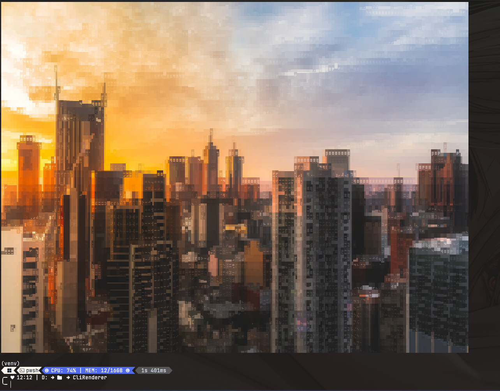
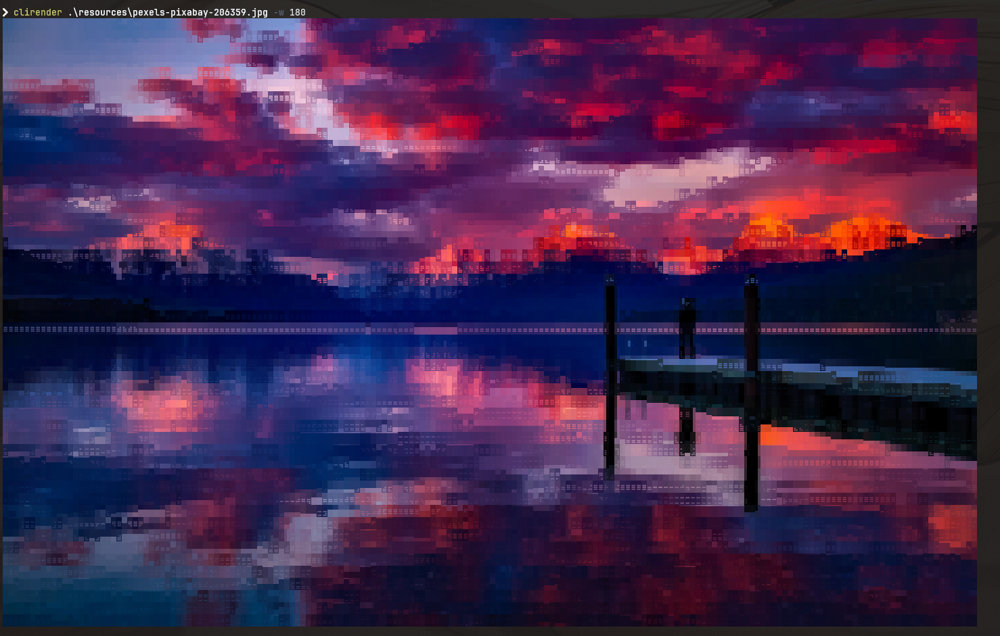

# CliRenderer

A text renderer that renders unicode art from images to the terminal

## Installation
Check the releases page for the latest version and instructions on how to install it.

## Usage
See `clirender --help` for a list of options and arguments.

### Notice when reading output

#### Linux
cat the contents like this
`cat outfile`

#### Windows Powershell
cat the contents like this
`Get-Content outfile -encoding UTF8`

This is because the contents of the output files will be encoded in utf-8. powershell defaults to utf-7 for some reason.

----
## Example Outputs:

[Original image from pexels](https://www.pexels.com/photo/view-of-high-rise-buildings-during-day-time-302769/)


[Original image from pexels](https://www.pexels.com/photo/dock-under-cloudy-sky-in-front-of-mountain-206359/)

## How It Works

### Disclaimer
I am terrible at explaining things.

----

This program mainly relies on unicode braille characters to represent pixels.

Braille characters are basically a 2x4 grid of dot(s).

First, I grayscale the image, this is important for later,

then I basically divided the image into many cells of 2x4 pixels width and height.

After because each image cell consists of 2x4 pixels that is grayscale, I can easily find the middle color.
Cycling through the cell, we can now convert the pixels into binary.
Pixel in the cell that are darker than the middle will be False
Pixels that are lighter wil be True
Now we have a boolean array representing bits.

The table below represent how each pixel in the cell correspond to its position in the array.
| 1 | 5 |
|---|---|
| 2 | 6 |
| 3 | 7 |
| 4 | 8 |

Coincidentally, braille characters are ordered the similarly in unicode.
| 1 | 4 |
|---|---|
| 2 | 5 |
| 3 | 6 |
| 7 | 8 |

However, for some reason, 7 is inserted before 4.

So we can just account for that by rearranging the array before converting it into binary like so:
```python
#pixels is the boolean array
converted = [pixels[7], pixels[3], pixels[6], pixels[5], pixels[4], pixels[2], pixels[1], pixels[0]]
```

After converting the array into binary, the binary is the index of the character in the string we need.

#### Coloring

During the process above, another image is generated, we call this a mask,

where it is white, the pixel will be represented by the braille character.

where it is black, the pixel will be represented by the background color.

We once again divide the image up into cells,

iterating through the pixels in the cells, we set 2 colors for each cell: fore and back.

The fore color is calculated by averaging the color from the image where pixel in the mask is white.

The back color is calculated by similarily but using where the pixel in the mask is black.

Then using [rich.py](https://github.com/Textualize/rich), we can color the foreground and background of each character using the fore and back character of each cell.

### More characters
braille characters unfortunately do not really take up the entire character space given to them.

This makes less noticeable, however we can subsitute some of the braille characters to give them more "weight".

For example, I replaced "⣀" with "▂".


